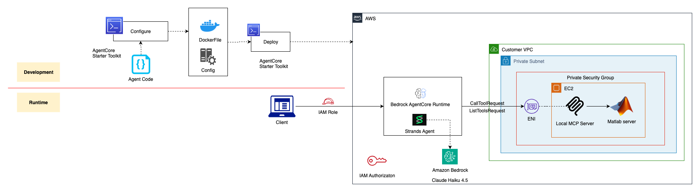

# Numerical Solver Agent with Private MCP Server

A Bedrock AgentCore agent deployed in VPC that connects to a private MATLAB MCP server for numerical problem-solving.

## Overview

This project demonstrates how to:
1. Deploy a MATLAB MCP server on EC2 in a private subnet
2. Create a Bedrock AgentCore Numerical Solver Agent in a VPC
3. Connect the agent to the private MCP server
4. Use IAM authentication (no Cognito required)
5. Test the agent with interactive prompts and sample problems

**Note:** The MATLAB MCP server (`matlab_mcp.py`) is a test implementation that simulates MATLAB-style mathematical functions. It is not a full version of MATLAB and provides a limited set of computational tools for demonstration purposes.

### What is the Numerical Solver Agent?

The Numerical Solver Agent is an expert computational assistant specializing in mathematical problem-solving and numerical analysis. It combines:

**MATLAB MCP Tools (15):**
- Statistical operations: mean, std, max, min, sum, product
- Mathematical functions: sqrt, abs, sin, cos, exp, log
- Array operations: linspace, diff, polyval

**Note:** These are test implementations that simulate MATLAB-style functions, not the full MATLAB software.

**Local Computational Tools (5):**
- Quadratic equation solver (real and complex roots)
- Factorial calculator
- GCD/LCM calculator
- Unit converter (length, temperature, weight)
- Percentage calculator

**Utility Tools (2):**
- Current time
- Error diagnostics

---

## Architecture



```
┌─────────────────┐
│  Client Script  │
│  (invoke_agent  │
│   .py)          │
└────────┬────────┘
         │ IAM Auth
         ▼
┌─────────────────────────┐
│  Numerical Solver Agent │
│  (VPC Deployment)       │
│  - Subnet: private      │
│  - Security Group       │
│  - Fresh MCP per req    │
└────────┬────────────────┘
         │ HTTP (Private IP)
         ▼
┌─────────────────────────┐
│  EC2 Instance           │
│  - Private Subnet       │
│  - MATLAB MCP Server    │
│  - Port 8000            │
└─────────────────────────┘
```

**Key Points:**
- Agent runs in VPC with private subnet access
- MCP server runs on EC2 in same VPC
- Communication via private IP (no internet gateway)
- IAM authentication for agent invocation
- Fresh MCP connection per request (no stale connections)
- 22 total tools available for numerical problem-solving

---


## Project Structure

```
numerical_solver_agent/
├── README.md                    # Complete setup guide
├── requirements.txt             # Python dependencies
├── settings.json.template       # Configuration template (rename to settings.json)
├── agent.py.template           # Agent runtime template
├── setup_agent.py              # Deployment script
├── invoke_agent.py             # Client script with interactive mode
├── cleanup.sh                  # Cleanup script
└── ec2/                        # Files for EC2 MCP server
    ├── matlab_mcp.py           # MATLAB-style MCP server
    └── requirements.txt        # EC2 dependencies

images/
└── architecture.png            # Architecture diagram
```

## Quick Start

1. **Setup Configuration**
   ```bash
   cd numerical_solver_agent
   cp settings.json.template settings.json
   # Edit settings.json with your VPC details
   ```

2. **Deploy MCP Server to EC2**
   - Upload `ec2/` folder to S3
   - Download to EC2 instance in private subnet
   - Install dependencies and run `matlab_mcp.py`

3. **Deploy Agent**
   ```bash
   uv venv
   source .venv/bin/activate
   uv pip install -r requirements.txt
   uv run setup_agent.py
   ```

4. **Test Agent**
   ```bash
   uv run invoke_agent.py
   ```

5. **Cleanup**
   ```bash
   ./cleanup.sh
   ```

## Features

- **22 Tools**: 15 MATLAB-style tools + 5 local computational tools + 2 utility tools
- **VPC Deployment**: Agent runs in private subnet with direct MCP server access
- **IAM Authentication**: No Cognito required
- **Interactive Mode**: Sample prompts and custom input support
- **Fresh Connections**: New MCP connection per request (no stale connections)

## Documentation

See [setup.md](setup.md) for complete setup instructions.

## Requirements

- Python 3.11+
- UV package manager
- AWS account with VPC, EC2, and Bedrock AgentCore access
- Private subnet with EC2 instance

## Note

The MATLAB MCP server is a test implementation that simulates MATLAB-style functions. It is not the full MATLAB software.
